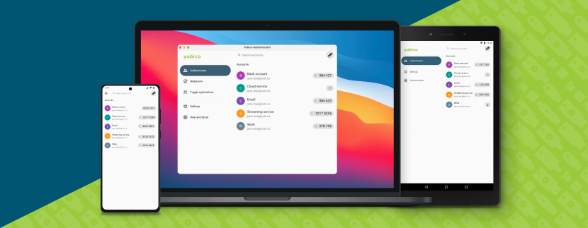

== Yubico Authenticator for Desktop and Android

Store your unique credential on a hardware-backed security key and take it
wherever you go from mobile to desktop. No more storing sensitive secrets on
your mobile phone, leaving your account vulnerable to takeovers. With the
Yubico Authenticator you can raise the bar for security.

* The Yubico Authenticator will work with any USB or NFC-enabled YubiKeys

The Yubico Authenticator securely generates a code used to verify your identity
as you are logging into various services. No connectivity needed!

=== Features include
* Secure - Hardware-backed strong two-factor authentication with secret stored
  on the YubiKey, not on your phone or computer
* Portable - Get the same set of codes across our other Yubico Authenticator
  apps for desktops as well as for all leading mobile platforms
* Flexible - Support for time-based and counter-based code generation
* USB or NFC usage - Insert the YubiKey into the USB port, or use the YubiKey
  with NFC with a mobile phone that is NFC-enabled or a desktop NFC reader to
  store your credential on the YubiKey
* Easy Setup - QR codes available from the services you wish to protect with
  strong authentication
* User Presence - Require a touch on the YubiKey sensor to generate new codes
  for sensitive accounts
* Compatible - Secure all the services currently compatible with other
  Authenticator apps
* Versatile - Support for multiple work and personal accounts

Experience security the modern way with the Yubico Authenticator.
Visit https://yubico.com to learn more.

=== System Requirements
The following operating systems are supported. The application may still run on other platforms.

* Windows 8.1 or later
* macOS High Sierra 10.13 or later
* Ubuntu 18.04 LTS or later
* Android 5.0 Lollipop or later

On Linux systems, make sure the `pcscd` service is installed and running.

=== Installation
Downloads for all supported operating systems are available
https://www.yubico.com/products/yubico-authenticator/[here].

=== Command line interface
Looking for a command line option? Try our
https://github.com/Yubico/yubikey-manager/[YubiKey Manager CLI] tool.

=== iOS
The iOS version of this app is available
https://github.com/Yubico/yubioath-ios[here].

=== Build instructions (for developers)
Instructions on building and packaging the app is available
link:doc/Development.adoc[here].
